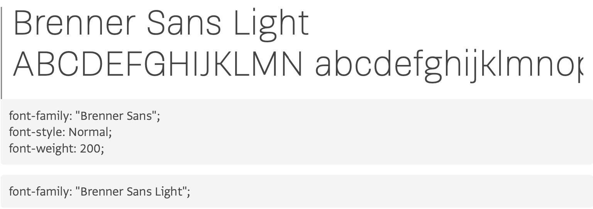
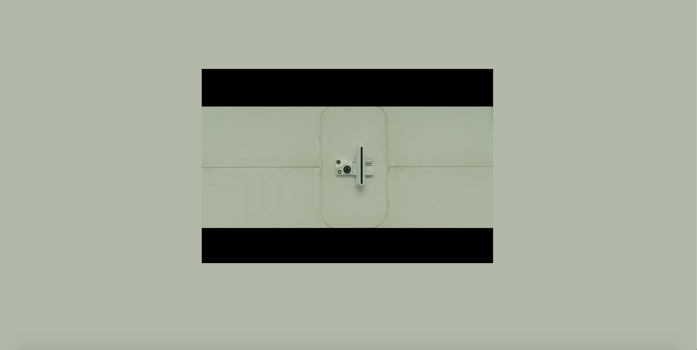

# Web Typography
Het filmfragment is bewerkt tot 1:26.

[Prototype](https://jemiah.github.io/web-typography/index.html)

# Exclusive design principles

### Study situation
Om een beter beeld te krijgen van de context heb ik de film Blade runner 2049 gekeken.
Hierdoor begreep ik het fragment beter want Joe moet kennelijk een baseline test doen om aan te tonen dat hij emotionele afwijking heeft. De scene komt best intens over. Nu is het voor mij een uitdaging om die intensiteit te verwerken in beeldelementen.

### Ignore conventions
Het is belangrijk om een consistent design te hebben. Zo staat de tekst altijd onder het iframe en staat het meestal op dezelfde plek. Op het moment dat iemand praat wordt er altijd weergeven wie er aan het woord is. Verder valt het ook op dat de achtergrond dezelfde kleur heeft als de achtergrond van de film.

### Prioritise identity
Ik bewerk dit filmfragment specifiek voor Darice. Darice is op latere leeftijd doof geworden. Ze is helemaal doof en maakt gebruik van een schrijftolk. Dit zijn de elementen die Darice belangrijk/leuk vindt wanneer zij een film kijkt:
-	Als er muziek te horen is wil ze de lyrics zien en de emotie moet ook overgebracht worden.
-	Donkergrijze teksten vindt ze mooi.
-	Neon kleuren zijn haar favoriete kleuren.
-	De tekst moet leesbaar zijn.
-	Ze houdt van minimalisme en white space.
-	Verschillende kleuren tekst voor de sprekers.
-	Spannende geluiden in kleur weergeven.
-	Er moet aangegeven worden wie spreekt.
Ik vind het belangrijk om zoveel mogelijk elementen toe te voegen die Darice belangrijk/leuk vindt.

Ik ben de designer en zelf vind ik niet dat ik nog een stijl heb ontwikkeld waarin je mijn werk herkent. Ik probeer zoveel mogelijk om met nieuwe ideeën te komen. Wat ik belangrijk vind is dat de toegevoegde elementen passen bij de film. 

### Add nonsense
Om het filmfragment zo leuk mogelijk te maken wil ik de scenes zo intens mogelijk maken. Zelf vind ik dat de scenes niet zoveel spanning hebben maar toen ik het zonder geluid had bekeken merkte ik dat je best wel veel sfeer mist van de film. Daarom vind ik het zo belangrijk om overboard te gaan met mijn ideeën en dat is ook gelukt.

---

# Typografie
Ik heb ervoor gekozen om Brenner te gebruiken omdat ik vind dat ik de emoties dan beter kan over brengen. Het font heeft veel opties om uit te kiezen. In het fragment wordt Joe geïnterviewd door iemand en ik denk dat ik het veel beter kan overbrengen als ik hiervoor verschillende fonts gebruik. Ook moet ik rekening houden met de achtergrond kleur anders zijn de fonts niet goed zichtbaar.

In het fragment zijn er 4 sprekers:

Interviewer 1 `class = ‘.voice1’`

De interviewer stelt vragen aan Joe op een serieuze toon.
#### Versie 1

 
 
Ik heb gekozen voor Brenner Mono Light omdat het een dunne font is die mij het gevoel van autoriteit. Ik heb het font een rode kleur (crimson) gegeven omdat de interviewer onaardig en serieus overkomt.

#### Versie 2 en versie 3

 
 
Darice heeft me als feedback gegeven om de letter dikker te maken daarom heb ik gekozen voor Brenner Mono Medium. Deze font is dikker dan versie 1. De kleur is hetzelfde gebleven

---

Joe `class = ‘.voice 2’`

Joe (Officer K D 6 - 3 . 7) is de hoofdpersoon in de film. Joe praat op een normale en serieuze manier.
#### Versie 1

 
 
Voor Joe heb ik gekozen voor Brenner Mono Regular. Ik heb voor deze font gekozen omdat ik wil dat de hoofdpersoon een neutrale font heeft. Het font heeft een grijze kleur (dim gray) omdat Darice donkergrijze teksten mooi vindt.

#### Versie 2 en versie 3
Ik heb de kleur van het font veranderd omdat het font anders niet goed te lezen is. De gekozen kleur is wit omdat wit heel neutraal is.

---

Officer `class= ‘.voice3’`

Wanneer Joe op de gang loopt en oogcontact maakt met een agent wordt hij door hem uitgescholden. De agent heeft een agressieve stem.
#### Versie 1

 

Ik heb gekozen voor de font Brenner Sans Condensed  Bold Italic omdat de agent op een agressieve toon praat. Hierom vind ik het ook toepasselijk om een dikke font te kiezen. De kleur van het font is zwart.

#### Versie 2

 

Ik heb ervoor gekozen om een dunnere font te gebruiken namelijk Brenner Sans Condensed Regular, omdat ik dat de toon beter overkomt. De kleur van het font heb ik veranderd naar donkerblauw omdat de achtergrond zwart is waardoor de tekst niet zichtbaar is. Ik heb voor blauw gekozen omdat de spreker een agent is.

#### Versie 3
Ik heb de font size vergroot zodat je echt merkt dat de agent boos is en het op een schreeuwerige manier zegt.

---

Interviewer 2 `class = ‘.voice4’`

Als Joe klaar is met de baseline test hoort hij van de tweede interviewer hoe hij het heeft gedaan. Ook deze interview praat met een serieuze toon.

#### Versie 1

 
 
Ik heb gebruik gemaakt van Brenner Sans Light, omdat deze interviewer ook een serieuze toon heeft. Ik heb ervoor gekozen om een groene (dark olive green) font te gebruiken omdat de interviewer Joe vertelt dat hij de baseline test heeft gehaald.

#### Versie 2

Omdat de stem en toon van interviewer 1 en 2 identiek is heb ik interviewer 2 dezelfde font gegeven als interviewer 1. 

#### Versie 3

Ik heb gekozen voor een dikkere font omdat het dan beter te lezen is voor Darice. Dit is dezelfde font als interviewer 1.

---

Verder hoor je ook sound effects. Alle sound effect vallen onder de `class= ‘.voice5’`.
#### Versie 2

 
 
De sound effects heb ik de font Brenner Mono gegeven omdat het heel neutraal overkomt. De kleur van het font is wit wat ik neutraal vind.

---
 
# Proces

## Versie 1
In week 1 heb ik me alleen gefocust op de typografie. Ik heb ervoor gezorgd dat elke spreker zijn font is aangepast.

#### Feedback
Darice 
1.	Voeg annotaties van de sound effects toe. 
2.	Op het moment dat Joe 3 keer achter elkaar interlinked zegt moet je duidelijk laten zien dat hij het 3 keer zegt. 
3.	Soms mag het font wel wat dikker

Vasilis
1.	Probeer zoveel mogelijk te experimenteren.

## Versie 2
Ik heb alle feedback van week 1 verwerkt en ik ben gaan experimenteren.
Ik wilde dat de kijker het gevoel kreeg alsof ze in de film zaten dus heb ik de achtergrond dezelfde kleur gegeven als de kleur van de achtergrond van de film.

  

Ik heb de soundeffects vormgegeven en ik heb tekstueel aangegeven wat voor geluid je hoort.

#### 0:07 [ALARM]

Het iframe schudt heen en weer terwijl je op de achtergrond een rode flits ziet.

 

#### 0:12 [BUZZ ALARM]

Het iframe zoomd in en achter het iframe schijnt rood licht.

#### 0:17 [BEEP ALARM]

Het iframe zoomt in en op de achtergrond zie je dat er aan de zijkant rood licht gloeit.

#### 0:32 [HIGH-PITCHED WHIRRING]

Eerst heb ik lijnen toegevoegd die op dezelfde positie staan als de lijnen van de kamer waar de baseline wordt gehouden. Ik wilde ervoor zorgen dat de lijnen zouden trillen terwijl de achtergrond flitst maar dat zag er niet goed uit. Vervolgens heb ik de lijnen weggehaald en heb ik ervoor gezorgd dat het iframe schudt van links naar rechts en inzoomt. Verder zie je een intense flits op de achtergrond zodat het geluid van de hoge piep beter wordt overgebracht. De tekst heb ik lager geplaatst zodat het nog te lezen is.

 
    
#### 1:17 einde van de baseline test

Wanneer de baseline is afgelopen zie je een groen lampje om aan te tonen dat hij de baseline test heeft gehaald. Ik heb dit er uiteindelijk uitgehaald omdat ik vind dat dat groene flits er niet mooi uitziet.

#### Feedback
Darice 
1.	De fonts zijn prima.
2.	De scene van de baseline test is te intens het mag wel wat minder.

Vasilis
1.	Zorg voor een balans tussen je animaties.

## Versie 3
#### 0:07 [ALARM]
Ik heb het alarm intenser gemaakt door het meer van links naar rechts te laten schudden.

#### 0:12 [BUZZ ALARM]
Ik heb ervoor gezorgd dat het iframe groter wordt.

#### 0:17 [BEEP ALARM]
Ook hier heb ik het ervoor gezorgd dat het iframe wat groter wordt.

#### 0:23 fuck-off, skin job!
Om deze line intenser te maken wordt het iframe heel klein wanneer de agent praat.

#### 0:32 [HIGH-PITCHED WHIRRING]
Ik heb geprobeerd om deze scene minder intens te maken. Van 0:32-0:58 de scene schudt het iframe en zie je een flits op de achtergrond daarna wordt het schudden en flitsen veel intenser. Van 0:58-1:16 wordt het schudden veel intenser en flitst de achtergrond sneller. Om 1:17 stopt het schudden en flitsen en gaat het iframe terug naar zijn normale formaat.
